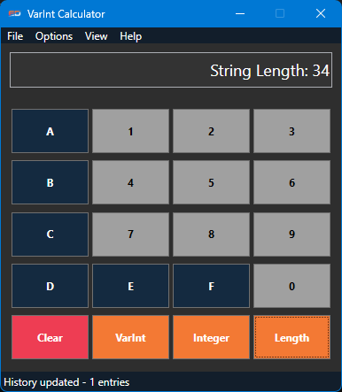

# VarInt Calculator

A Windows desktop application for encoding and decoding variable length integers (VarInts) as used in SQLite databases. This application helps forensic analysts and database specialists work with variable-length integer encoding.

## Features

- **Convert Decimal to VarInt**: Easily encode any decimal number to its VarInt representation in hexadecimal
- **Decode VarInt to Integer**: Convert hexadecimal VarInt representation back to decimal
- **String/BLOB Length Calculation**: Calculate string or blob length from VarInt values
- **History Tracking**: Keep track of all conversions performed
- **Tutorial Mode**: Learn how VarInt encoding works with a step-by-step tutorial
- **Dark Mode**: Easy on the eyes interface for extended use

## How It Works

VarInt (Variable-length Integer) is a method of serializing integers using one or more bytes. The format is used in SQLite and other database systems to efficiently store variable-length integers.

- Smaller integers require fewer bytes to encode
- The highest bit of each byte indicates if more bytes follow (1) or not (0)
- The remaining 7 bits in each byte store the actual value

## Installation

### Prerequisites
- Windows operating system
- .NET 9.0 Runtime

### Installation Options

#### Option 1: Installer
1. Download the latest installer from the [Releases](https://github.com/eichbaumj/VarInt-Calculator/releases) page
2. Run the installer and follow the on-screen instructions

#### Option 2: Build from Source
1. Clone this repository
2. Open the solution in Visual Studio 2022 or later
3. Build the solution in Release mode
4. The application will be available in the bin/Release directory

## Usage

### Basic Conversion
1. Enter a decimal number in the input field
2. Click "VarInt" to convert to VarInt encoding (hexadecimal)
3. OR enter a hexadecimal VarInt value
4. Click "Integer" to convert to a decimal number

### String/BLOB Length Calculation
1. Enter a hexadecimal VarInt value
2. Click "Length" to calculate the string or blob length
   - String lengths are calculated from odd values (13 + 2n)
   - BLOB lengths are calculated from even values (12 + 2n)

## Building the Installer

If you want to build the installer yourself:
1. Ensure Inno Setup 6 is installed
2. Run the included create_installer.bat script
3. The installer will be created in the project directory

## License

Copyright © 2025 Elusive Data. All rights reserved.

## About Elusive Data

[Elusive Data](https://elusivedata.io) specializes in digital forensics tools and solutions. For support, contact support@elusivedata.io. 