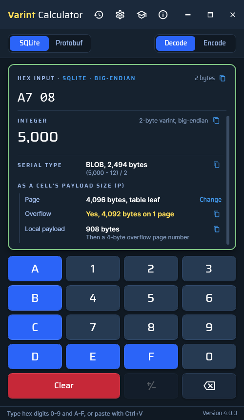

# Varint Calculator

A free Windows tool from Elusive Data for reading and writing variable-length integers
(varints) by hand: the big-endian varints in SQLite files and the little-endian varints in
Protocol Buffers data. It is a standalone app in the style of the Firefly suite.



## Install

Download the installer from [Releases](https://github.com/eichbaumj/VarInt-Calculator/releases)
and run it (Windows 10 or 11, 64-bit; no separate .NET install needed). It upgrades 3.0 in place.

## What it does

- **Decode** hex bytes to an integer as you type, or **Encode** a whole number (negative
  numbers included) to varint bytes.
- **SQLite** varints are big-endian, 1 to 9 bytes, and all 8 bits of a 9th byte are value bits.
  **Protobuf** varints are little-endian (LEB128), 1 to 10 bytes. Switching the format re-reads
  the same bytes, so you can compare the two readings.
- Every result is shown with what it means read each way:
  - SQLite: the signed 64-bit value (a negative rowid), the record serial type (TEXT or BLOB
    length, integer size, and so on), and the value as a cell's payload size.
  - Protobuf: int32/int64, ZigZag (sint32/sint64), bool, and the value as a field tag
    (field number and wire type).
- **Local payload and overflow**: for a cell's payload size P, the calculator shows whether
  the payload overflows and how many bytes stay on the b-tree page (the local payload), using
  SQLite's own rules. Set the page size, the reserved bytes per page (header offset 20) and the
  b-tree type (table leaf or index) in Settings.
- Notes point out bytes after the varint, encodings that are not the shortest form, and values
  larger than SQLite allows.
- **History** keeps the last 50 results; click one to bring it back.
- **Tutorial** walks through decoding by hand, with examples you can load onto the calculator.
- Default, Dark and Light themes.

## Keyboard

| Keys | Action |
| --- | --- |
| 0-9, A-F | Type a digit (A-F in Decode) |
| - | Change the sign (Encode) |
| Backspace | Delete the last digit |
| Esc or Delete | Clear (Esc also closes an open panel) |
| Enter | Add the result to History |
| Ctrl+C / Ctrl+V | Copy the result / paste hex bytes or a number |
| Ctrl+1 / Ctrl+2 | SQLite / Protobuf |
| Ctrl+D / Ctrl+E | Decode / Encode |
| Ctrl+H | History |
| F1 | Tutorial |

Pasted hex can use spaces, commas, colons, `0x` or `\x` prefixes.

## Accuracy

The numbers are checked against reference implementations, not against the calculator's own
arithmetic. `tools/oracle/make_vectors.py` has SQLite (Python's `sqlite3`) write real database
files and Google's protobuf runtime serialize and parse fields, then records what they produced:
rowid and payload-size varints, serial types, and how each cell's payload divides between the
page and its overflow chain, measured byte for byte across page sizes from 512 to 65,536,
reserved bytes and both b-tree types. The vectors are committed in
`VarIntCalculator.Tests/Vectors`.

```
dotnet run --project VarIntCalculator.Tests/VarIntCalculator.Tests.csproj
```

To regenerate the vectors (Python 3 with the `protobuf` package):

```
python tools/oracle/make_vectors.py
```

## Building

Requires the .NET 9 SDK on Windows.

```
dotnet build VarIntCalculator.sln -c Release
dotnet run --project VarIntCalculator.csproj
```

The installer (Inno Setup 6) is built like Firefly's: dark wizard, the blue-wave header, a
consent tick-box and a launch option at the end. One command runs the tests, publishes the app
self-contained for win-x64 and compiles `VarIntCalculator_Setup.iss` into
`Installer\VarintCalculator_4.0.0_x64.exe`:

```
powershell -ExecutionPolicy Bypass -File setup\Build-Installer.ps1
```

The art is generated, not hand-edited: `setup/make_app_icon.py` builds `icon.ico` (the V, for
the app, its shortcuts and the setup program) from `setup/art/varint-v-1024.png`, and
`setup/make_installer_art.py` builds the wizard bitmaps from the Elusive Data mark and word art.

Settings and history are kept in `%APPDATA%\Elusive Data\Varint Calculator`.

## Fonts

Be Vietnam Pro, Inter and Saira are bundled under the SIL Open Font License; the license
texts are in `Fonts` and ship beside the app.

## License

Copyright © 2025 Collara Works AB, trading as Elusive Data. All rights reserved.

[Elusive Data](https://www.elusivedata.io) makes digital forensics tools. For support, contact
support@elusivedata.io.
